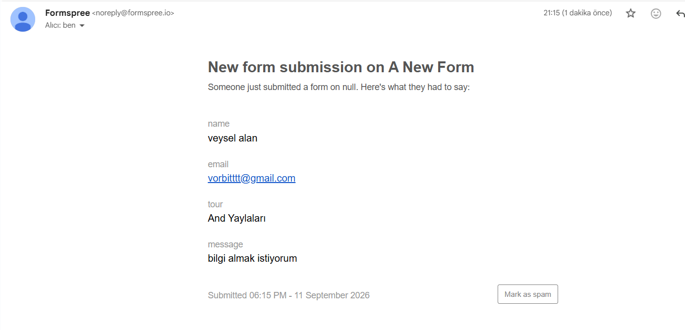
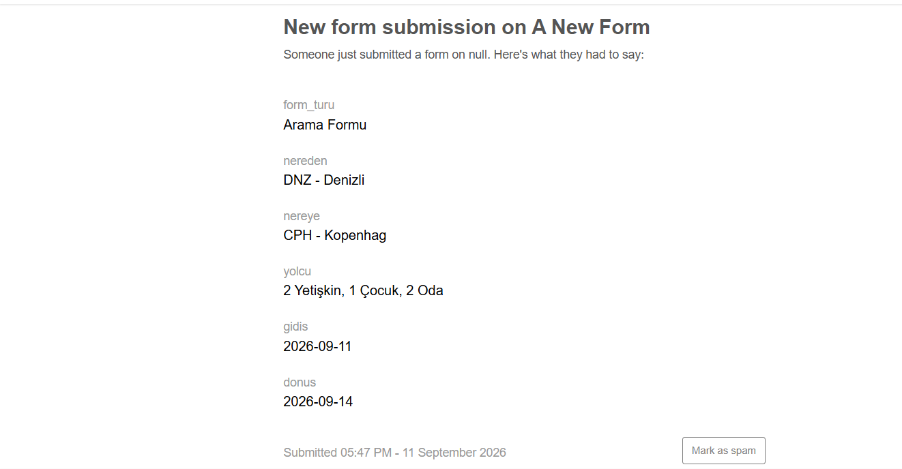

# Nomadica

Nomadica, HTML, CSS (Bootstrap 5) ve vanilla JavaScript ile geliştirilmiş bir seyahat/tur sitesi projesidir.

## Video

<video src="https://github.com/user-attachments/assets/dc61a798-084e-4321-85f5-4eb6e2177c8e" controls muted width="600"></video>

## İletişim Sayfası

## Arama Çubuğu

## Bu projede neler yaptım?

- Bootstrap grid sistemi ve kendi yazdığım özel CSS ile 4 sayfalık (Ana Sayfa, Turlar, Hakkımızda, İletişim) tutarlı bir tasarım kurdum.
- Bölge, zorluk seviyesi ve süreye göre çalışan bir tur filtreleme özelliğini saf JavaScript ile (data-* attribute'ları ve DOM manipülasyonu kullanarak) yazdım.
- Ana Sayfa ve Turlar sayfalarına, fon fotoğrafı üzerine oturan gradient tasarımlı bir arama çubuğu ekledim — Nereden/Nereye (havalimanı seçimi), Gidiş/Dönüş tarihi ve Yetişkin/Çocuk/Oda sayacı içeren, kendi açılır paneli olan bir yolcu seçimi.
- Formspree entegrasyonuyla hem iletişim formunda hem arama çubuğunda gerçek, çalışan form gönderimi kurdum — boş alan kontrolünü hem JavaScript hem de HTML5 `required` ile çift katmanlı hale getirdim.
- Sitenin tamamını mobil uyumlu (responsive) hale getirdim.
- Kullanıcı geri bildirimine göre site fontunu (Oswald yerine Nunito Sans) daha ferah ve okunması rahat bir fontla güncelledim.

## Kullanılan teknolojiler

| Teknoloji | Amaç |
| --- | --- |
| HTML5 | Sayfa yapısı |
| CSS3 (Bootstrap 5.3.3) | Tasarım ve grid sistemi |
| JavaScript (vanilla) | Filtreleme, arama çubuğu etkileşimi ve form doğrulama |
| Bootstrap Icons | İkonlar |
| Formspree | İletişim ve arama formu backend'i |
| Google Fonts (Nunito Sans, Rubik) | Tipografi |

## Klasör yapısı

    travel-main/
    ├── assets/
    │   ├── contact-mail.png
    │   ├── search-bar.png
    │   └── travel-tanitim.mp4
    ├── css/
    │   ├── components.css
    │   ├── layout.css
    │   ├── responsive.css
    │   └── style.css
    ├── images/
    │   ├── logo.png
    │   └── nomadica-icon.png
    ├── javascript/
    │   ├── turlar.js
    │   └── arama-cubugu.js
    ├── about.html
    ├── contact.html
    ├── index.html
    ├── readme.md
    └── tours.html

## English

## Demo Video

<video src="https://github.com/user-attachments/assets/dc61a798-084e-4321-85f5-4eb6e2177c8e" controls muted width="600"></video>

## Contact Page

## Search Bar

## What did I do in this project?

- Built a 4-page (Home, Tours, About, Contact) consistent design using the Bootstrap grid system and my own custom CSS.
- Wrote a working tour filter feature (by region, difficulty, and duration) in vanilla JavaScript, using data-* attributes and DOM manipulation.
- Added a gradient-styled search bar to the Home and Tours pages, placed over a background photo — with From/To (airport selection), Departure/Return dates, and a passenger counter (Adults/Children/Rooms) with its own dropdown panel.
- Integrated Formspree for real, working form submissions on both the contact form and the search bar — with double-layer validation using both JavaScript and HTML5 `required`.
- Made the entire site responsive for mobile devices.
- Updated the site's font (from Oswald to Nunito Sans) based on user feedback, for a more spacious and comfortable reading experience.

## Technologies used

| Technology | Purpose |
| --- | --- |
| HTML5 | Page structure |
| CSS3 (Bootstrap 5.3.3) | Styling and grid system |
| JavaScript (vanilla) | Filtering, search bar interactivity, and form validation |
| Bootstrap Icons | Icons |
| Formspree | Contact and search form backend |
| Google Fonts (Nunito Sans, Rubik) | Typography |

## Folder structure

    travel-main/
    ├── assets/
    │   ├── contact-mail.png
    │   ├── search-bar.png
    │   └── travel-tanitim.mp4
    ├── css/
    │   ├── components.css
    │   ├── layout.css
    │   ├── responsive.css
    │   └── style.css
    ├── images/
    │   ├── logo.png
    │   └── nomadica-icon.png
    ├── javascript/
    │   ├── turlar.js
    │   └── arama-cubugu.js
    ├── about.html
    ├── contact.html
    ├── index.html
    ├── readme.md
    └── tours.html
    