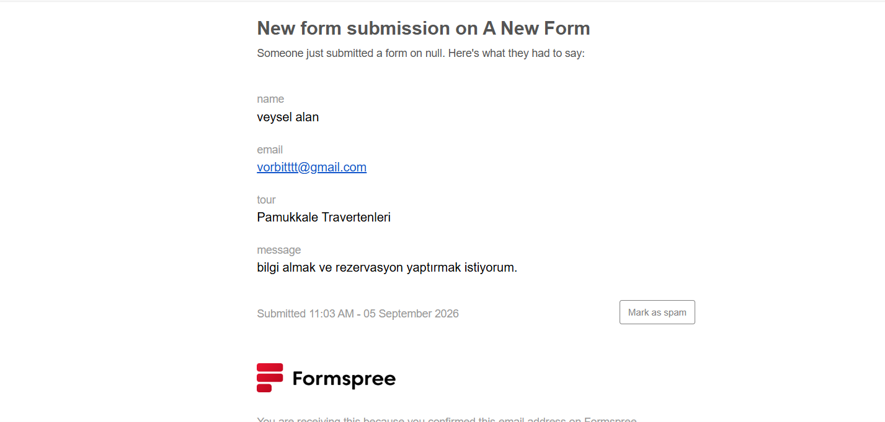

# Nomadica

Nomadica, HTML, CSS (Bootstrap 5) ve vanilla JavaScript ile geliştirilmiş bir seyahat/tur sitesi projesidir.

## Tanıtım videosu

[Tanıtım videosunu izle](assets/travel.mp4)

## İletişim formu

## Bu projede neler yaptım?

- Bootstrap grid sistemi ve kendi yazdığım özel CSS ile 4 sayfalık (Ana Sayfa, Turlar, Hakkımızda, İletişim) tutarlı bir tasarım kurdum.
- Bölge, zorluk seviyesi ve süreye göre çalışan bir tur filtreleme özelliğini saf JavaScript ile (data-* attribute'ları ve DOM manipülasyonu kullanarak) yazdım.
- Formspree entegrasyonuyla gerçek, çalışan bir iletişim formu ekledim.
- Sitenin tamamını mobil uyumlu (responsive) hale getirdim.

## Kullanılan teknolojiler

| Teknoloji | Amaç |
| --- | --- |
| HTML5 | Sayfa yapısı |
| CSS3 (Bootstrap 5.3.3) | Tasarım ve grid sistemi |
| JavaScript (vanilla) | Filtreleme ve etkileşim |
| Bootstrap Icons | İkonlar |
| Formspree | İletişim formu backend'i |

## Klasör yapısı

    travel/
    ├── assets/
    │   ├── travel.mp4
    │   └── mail.png
    ├── css/
    │   ├── components.css
    │   ├── layout.css
    │   ├── responsive.css
    │   └── style.css
    ├── images/
    │   ├── logo.png
    │   └── nomadica-icon.png
    ├── javascript/
    │   └── turlar.js
    ├── about.html
    ├── contact.html
    ├── index.html
    ├── readme.md
    └── tours.html

## English

## Demo video

[Watch the demo video](assets/travel.mp4)

[Watch the demo video](assets/travel-tanitim.mp4)

## Contact form

## What did I do in this project?

- Built a 4-page (Home, Tours, About, Contact) consistent design using the Bootstrap grid system and my own custom CSS.
- Wrote a working tour filter feature (by region, difficulty, and duration) in vanilla JavaScript, using data-* attributes and DOM manipulation.
- Added a real, working contact form using Formspree integration.
- Made the entire site responsive for mobile devices.

## Technologies used

| Technology | Purpose |
| --- | --- |
| HTML5 | Page structure |
| CSS3 (Bootstrap 5.3.3) | Styling and grid system |
| JavaScript (vanilla) | Filtering and interactivity |
| Bootstrap Icons | Icons |
| Formspree | Contact form backend |

## Folder structure

    travel/
    ├── assets/
    │   ├── travel.mp4
    │   └── mail.png
    ├── css/
    │   ├── components.css
    │   ├── layout.css
    │   ├── responsive.css
    │   └── style.css
    ├── images/
    │   ├── logo.png
    │   └── nomadica-icon.png
    ├── javascript/
    │   └── turlar.js
    ├── about.html
    ├── contact.html
    ├── index.html
    ├── readme.md
    └── tours.html

    

